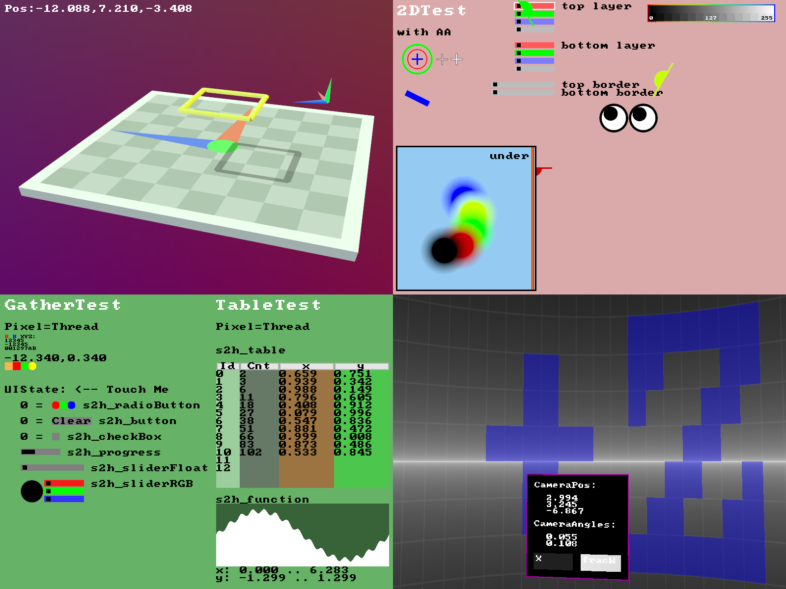
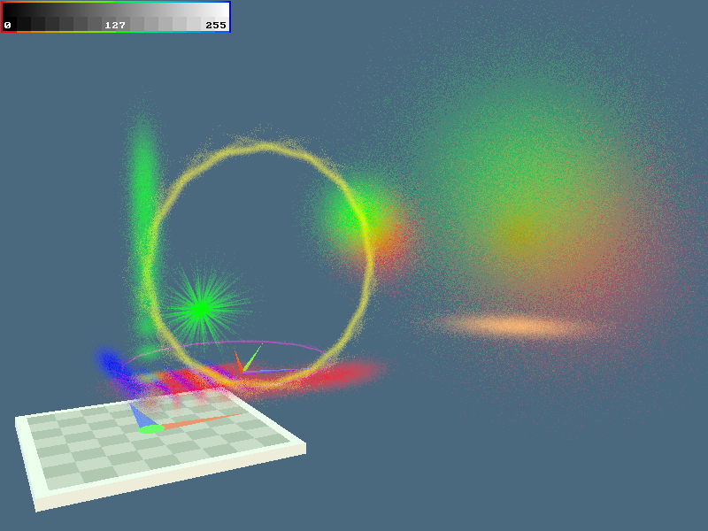

# Shader To Human (S2H) - HLSL/GLSL library for debugging shaders

This tool helps you with shader writing and debugging. It's meant to be used for small specific use cases (printing or drawing a few number, 2D or 3D elements)
as it was optimized for ease of integration (~ one file, few lines of code). It is not targeting complex UI or minimal performance impact.

The permissive [license](https://raw.githubusercontent.com/electronicarts/ShaderToHuman/refs/heads/master/LICENSE.txt) makes it free for commercial use.

We suggest you browse the [interactive documentation](https://electronicarts.github.io/ShaderToHuman).
You can explore more samples in [Gigi](https://github.com/electronicarts/gigi) (Search in GigiBrowser for "Human") and you will see how
rapid prototyping in shaders becomes straightforward. Use PrintF debugging, draw a watch window in the viewport or use 
2d and 3d shapes with ease. No C++ code changes, no buffer setup or content setup required.

Videos and presentation: [Coming soon](https://graphicsprogrammingconference.com/2025)

S2H Features in Gigi: 
S2H used to render [Gaussian Splatting](https://github.com/graphdeco-inria/gaussian-splatting) with a stochastic rasterizer (input .ply was procedurally generated): 

## Installing the web documentation and running locally
This is only needed for development on the library. Windows only.
- NodeJS: Install https://nodejs.org/en/download 'Windows Installer x64(.msi)'. Reboot.
- Run startLocalServer.bat (double click, on first start it will install 'express')
- Connect a web browser to the shown web address.

## Roadmap / Plans
* Reach out for suggestions, maybe CUDA support

## Support / Authors
* Martin Mittring MMittring@ea.com Kosmokleaner@Kosmokleaner.de (main author)
* Anushka Nair AnuNair@ea.com

## Acknowledgment
* Alan Wolfe for Gigi
* Electronic Arts and the SEED team

## License
The source code is released under an open license as detailed in License.txt.

## Folder structure

* 'include' S2H core include files in HLSL (all you need for hlsl or glsl with preprocessor)
* 'docs/include' S2H core include files in HLSL (all you need for glsl without preprocessor)
* 'examples' S2H core examples to be run with Gigi

* 'unittests' Gigi technique and shaders to verify function, run python from Gigi DX12 Viewer.
* 'docs_src' S2H examples for the web documenation, source for transpileToGLSL.bat
* 'README.md' this file, github/gitlab start page
* 'teaser.png' used for README.md and Gigi technique browser
* 'transpileToGLSL.bat' to converts hlsl code to glsl, needed for server or if you want to use glsl directly
* 'startLocalServer.bat' to locally browse and iterate on the documentation 
* 'server.js', 'utils', 'docs' HTML documentation, needed to locally browse the documentation
* 'node_modules' generated by node.js, to browse the documentation locally 

## Project status
Functional, Open Source

## To do:
With task size in days or hours for a some specific (value does not matter but ratio between tasks should be about right) programmer.

1) 4h Pass text in string literals e.g. (ui, “text”) vs (ui, _t, _e, _x, _t) as optional API (for modern HLSL only) [link](https://github.com/GPUOpen-LibrariesAndSDKs/WorkGraphPlayground/blob/main/tutorials/tutorial-0/HelloWorkGraphs.hlsl)
2) 1d Fix table and function plotting for GLSL. Seems GLSL forward declaration of functions is different from HLSL and we have to find a different solution
3) 1d Implement a 80x25 text screen optional API (another .hlsl include file) for better performance with similar functions as it gather and scatter API. A simple start would just write ASCII characters into a uint per character (80x25*4 bytes). We can store the characters and text + background color. A post process or quad pixel shader can project the final text screen (80x25 * 8x8 char pixels), ideally with a C64 style border. Vertical scrolling on bottom of screen would be nice but not needed. It could be implemented without a lot of memory copies if we implement a cyclic view into the memory (store start Y, scrolling is simply ).
4) 1h Add vertical slider
5) 1h Add 2d slider (x and y position in a box)
6) 4h Horizontal and vertical scroll bar (drag bars show the size of the view)
7) 1d Combine scroll bars with table view to scroll larger views vertically, optional as table API should not get more complex
8) 5d Implement for other APIs ? e.g. WebGPU, CUDA,   only if there is interest
9) 3d Documentation only offer GLSL fragment shader and HLSL compute shader, we should add HLSL pixel shader.
10) 5d Add working GLSL samples other than WebGL (browsers might emulate with DirectX), ideally OpenGL and Vulkan
11) 7d Optional API (another .hlsl include file) to record operations to be persistent (Atomic to serialize function id and parameters, reader to play back the commands)
12) 1h Polish documentation for triangle and arrow to show the available options
13) 2d Make all documentation interactive (e.g. respond to mouse) or animated (time dependent)
14) 3d Fix documentation needs a while to compile shaders before it can show content.
15) 4h Interactive texture zoom (pixelated) in postprocess with color RGB debugger
16) 3d Interactive buffer debug with hex / float / int, scrollbars for large content
17) 1d Add drawOBB() (3d oriented bounding box, passing in position and 3x3 base, can transform the ray and use drawAABB())

## Contributing

Before you can contribute, EA must have a Contributor License Agreement (CLA) on file that has been signed by each contributor. You can sign here: http://bit.ly/electronic-arts-cla

Any contribution - large or small - is much appreciated and earns you a spot on the contributors list. Just add your name to the list (alpha sorted) as part of your pull request!

As far as coding standards, we need to write them up and automate them as much as we can, but for now, try to make your code look like other code.

With each pull request, besides testing any functionality you are touching, please also verify that all .gg files in Gigi and that the the Python unit test are still passing, consider adding unit tests if appropriate. Run transpileToGLSL.bat as it generates .hlsl and .glsl files derived from input .hlsl files, those are used by the WebGL documentation. Cycle through the affected 
documentation pages.

To run the viewer unit tests, from inside the viewer select File->Run Python Script and choose **unittests/GigiTest.py**.  It should report that it has zero errors.

##

<b>Search for Extraordinary Experiences Division (SEED) - Electronic Arts
 
<a href="https://seed.ea.com">seed.ea.com</a>
 
SEED is a pioneering group within Electronic Arts, combining creativity with applied research.</b>  
We explore, build, and help define the future of interactive entertainment.

